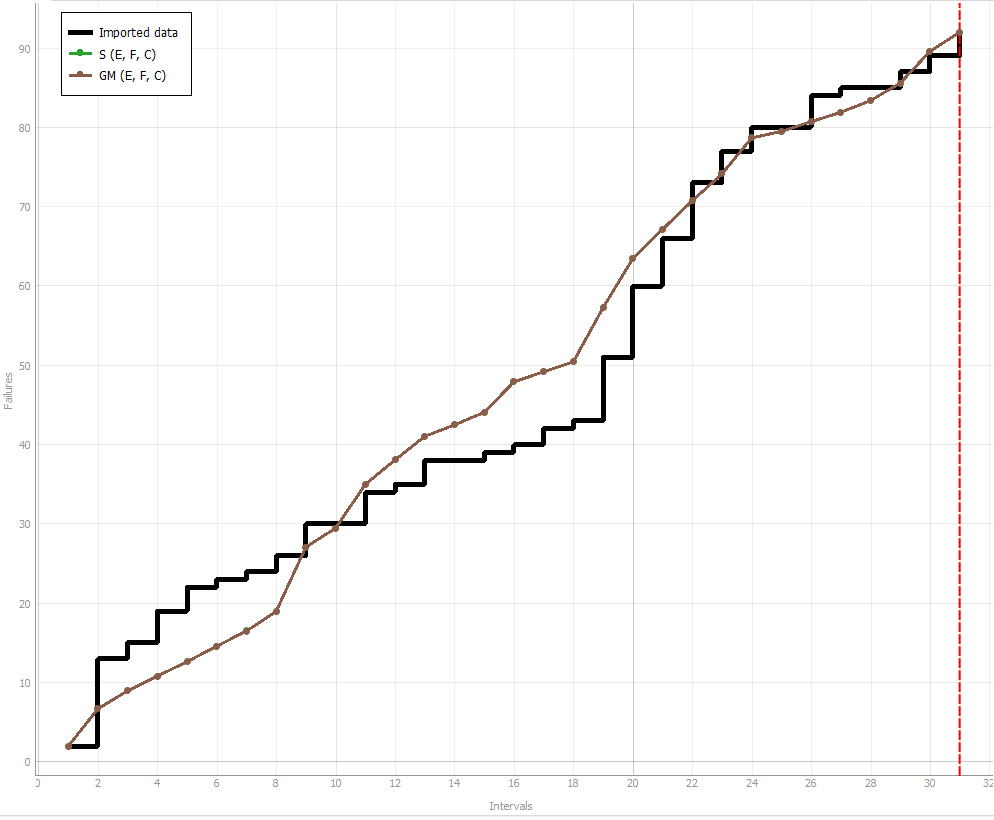
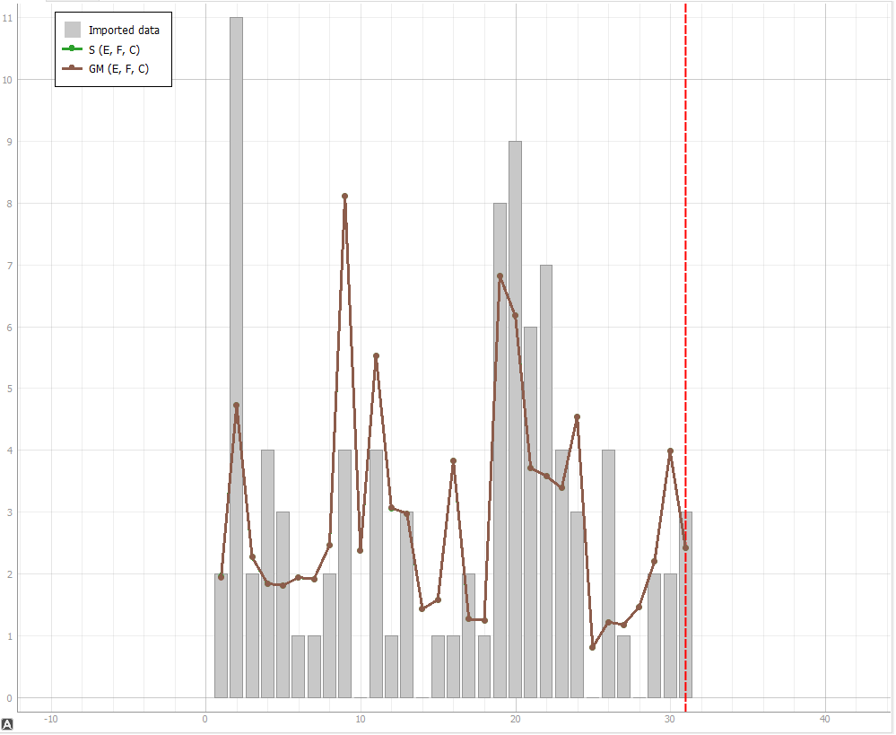
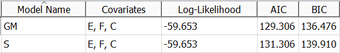

**SENG 438- Software Testing, Reliability, and Quality**

**Lab. Report \#5 – Software Reliability Assessment**

| Group \#:       | 34  |
|-----------------|---|
| Student Names:  |  Jonas Wong |
|                 |  Ryan Huynh |
|                 |   |
|                 |   |

# Introduction

# Assessment Using Reliability Growth Testing 
## Model Comparison Results
The top two models selected to fit the failure data the most was the Geomtric Model and the S Distribution Model. Visually, they fit closer to the shape of failure data in an MVF graph as well as in an intensity graph. They also seem to visually be equal, as the line graph of each model for this failure data cover the same points. However, by looking at the calculated AIC and BIC, the geometric model (GM) has a lower value then the S Distribution Model (S). This means that the geometric model is a better model than the S Distribution Model.

# Assessment Using Reliability Demonstration Chart 

# 

# Comparison of Results

# Discussion on Similarity and Differences of the Two Techniques

# How the team work/effort was divided and managed
We split up into two pairs where each pair would work primarily on either part one or part two. Though the teams were split, we also made sure to always check up with the other team to make sure that we understood all parts of the lab and that we could help out anytime any issues arise. We did this by making sure that we would meet up every few days to discuss what was done and if any additional help was needed and though both teams were working on different parts, we tried to collaborate whenever we could. 

# Difficulties encountered, challenges overcome, and lessons learned
For creating the RDC, figuring out what values to change to get the required results was confusing. We learned how to use excel better, especially with graphs and learned how MTTF would effect the whether the system would be within the reject, continue, or accept ranges.

# Comments/feedback on the lab itself
There weren't as many instructions and helpful tips for this lab so it was harder to understand how to use some of the tools given. As for the actual lab itself, because of the sparse amount of instructions, we had many difficulties figuring out what we were supposed to do and how to do it. For example, for the RDC portion of the lab, there was a lot of data all over the place and it was extrememly confusing finding out what values would need to be changed/what data to pay attention to in the first place. More details on what to focus on and how to proceed with the lab would have been extremely helpful.  
